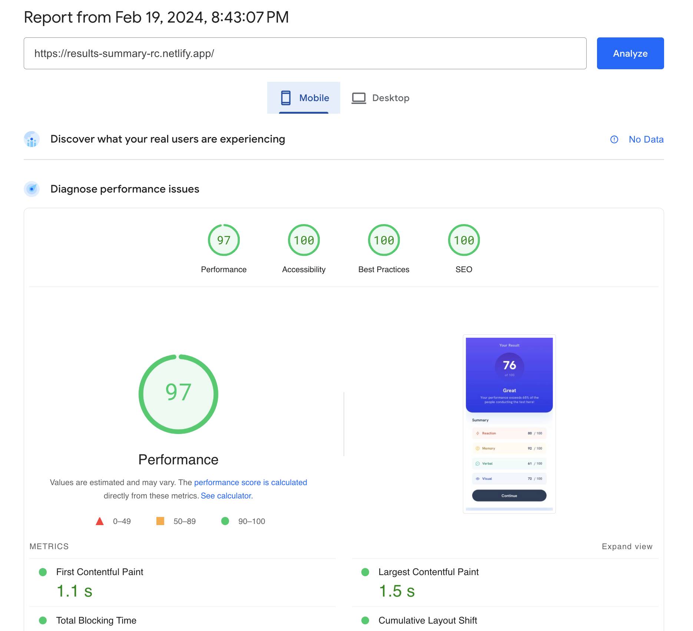
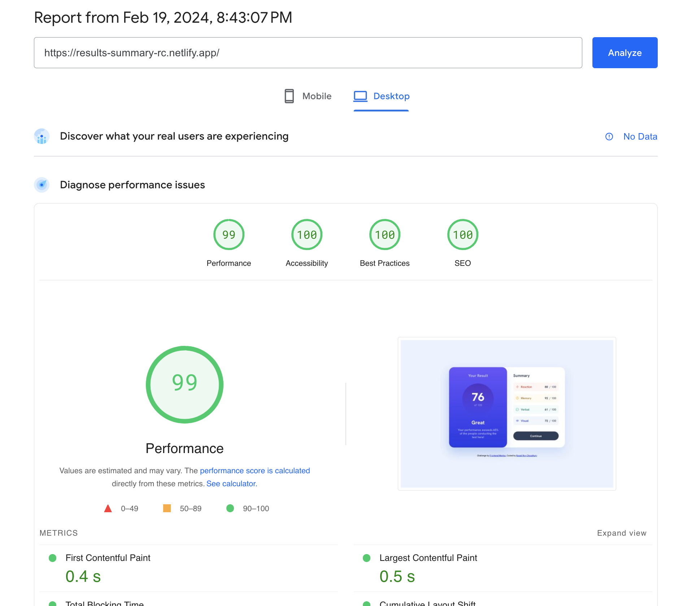

# Frontend Mentor - Results summary component solution

This is a solution to the [Results summary component challenge on Frontend Mentor](https://www.frontendmentor.io/challenges/results-summary-component-CE_K6s0maV). Frontend Mentor challenges help you improve your coding skills by building realistic projects.

## Table of contents

- [Overview](#overview)
  - [The challenge](#the-challenge)
  - [Screenshots](#screenshots)
  - [PageSpeed Insights results](#pagespeed-insights-results)
  - [Links](#links)
- [My process](#my-process)
  - [Built with](#built-with)
  - [Tested with](#tested-with)
  - [What I learned](#what-i-learned)
  - [Continued development](#continued-development)
  - [Useful resources](#useful-resources)
- [Author](#author)
- [Acknowledgments](#acknowledgments)

## Overview

### The challenge

Users should be able to:

- View the optimal layout for the interface depending on their device's screen size
- See hover and focus states for all interactive elements on the page
- Use the local JSON data to dynamically populate the content

### Screenshots

##### 1. Desktop version

##### 2. Mobile version

### PageSpeed Insights results

[Mobile version](https://pagespeed.web.dev/analysis/https-results-summary-rc-netlify-app/12gimzc15z?form_factor=mobile)

[Desktop version](https://pagespeed.web.dev/analysis/https-results-summary-rc-netlify-app/12gimzc15z?form_factor=desktop)

### Links

- Solution URL: [Results summary component github](https://github.com/rupali317/results-summary-component-main)
- Live Site URL: [Results summary component live URL](https://results-summary-rc.netlify.app/)

## My process

### Built with

- Semantic HTML5 markup
- CSS custom properties
- Flexbox
- CSS Grid
- Mobile-first workflow
- [React](https://reactjs.org/) - JS library
- [Styled Components](https://styled-components.com/) - For styles

### Tested with

- Browsers used for testing: Google Chrome, Firefox, Safari, Brave, Microsoft Edge
- Devices:
  - (Real) MacBook Pro (15 inch), Samsung Galaxy A33 5G, Samsung Galaxy S20+, iPad Air 2
  - (Virtual) The mobile and tablet devices mentioned under Chrome's dev console
- Screen reader: MacOS VoiceOver

### What I learned

- `linear-gradient` works on background and not background-color since the latter expects a solid color.
- While using description list would gave been more appropriate instead of unordered list, the former can cause accessibility issues. For instance, when I used description list and used VoiceOver, it declared 8 items instead of 4 items under the summary. Therefore, I reverted back to using unordered list.

### Continued development

Use Storybook to generate the variations of results.

### Useful resources

- [Description lists's accessibility concerns](https://developer.mozilla.org/en-US/docs/Web/HTML/Element/dl#accessibility_concerns) - This helped me be aware of how different screen readers can interpret `<dl>` differently

## Author

- Website - [Rupali Roy Choudhury](https://www.linkedin.com/in/rupali-rc/)
- Frontend Mentor - [@rupali317](https://www.frontendmentor.io/profile/rupali317)

## Acknowledgments

- I express my gratitude towards my mentor - Deborah for the insightful code review session and for demonstrating how styled ocmponents can be used to effectively display the variation in stylings of results.
- I thank Front end mentor members in answering my doubts related to the usage of css custom properties in `@font-face`
